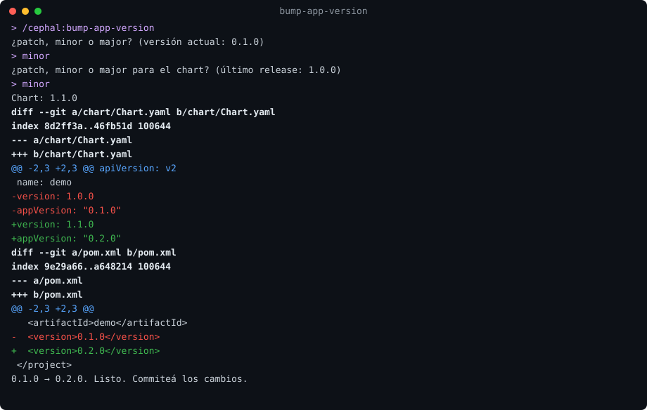
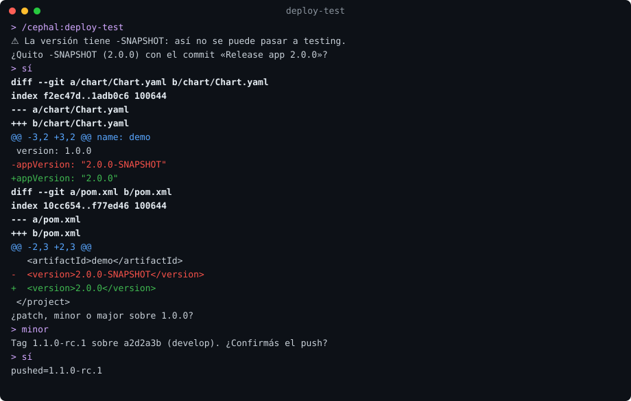
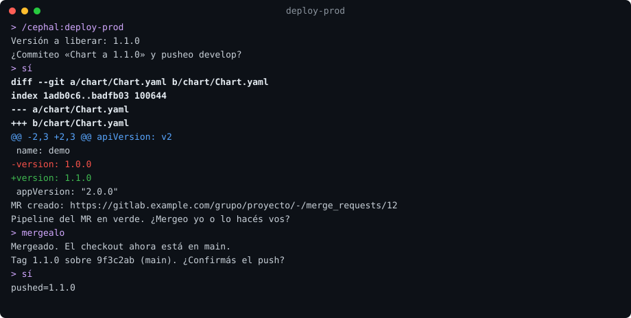
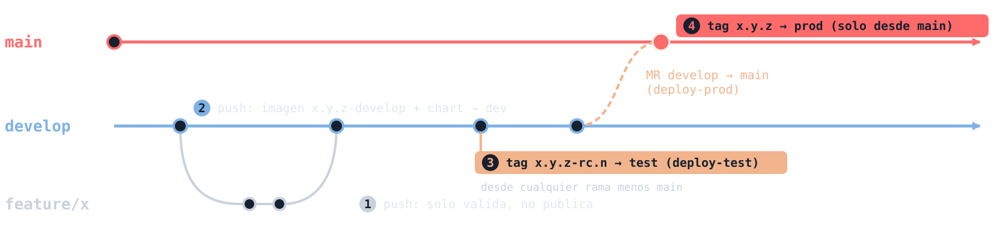

# cephal-skills

Skills para agentes de código (Claude Code, Codex, OpenCode y otros) que ayudan a versionar la app y a desplegar por tags a test y prod en proyectos que usan los pipelines de la familia cephal.

| Skill | Qué hace |
|---|---|
| `bump-app-version` | Sube la versión de la app (pom, gradle, npm, pnpm), alinea `appVersion` de `Chart.yaml` y, si el chart ya fue liberado, deja la siguiente versión del chart. Solo en la rama de desarrollo. No commitea. |
| `deploy-test` | Crea y pushea el tag `x.y.z-rc.n` (despliega a test). No corre en `main`. |
| `deploy-prod` | Integra `develop` en `main` por MR y crea el tag `x.y.z` en `main` (habilita prod). Puede salir sin RC previo. |
| `show-versioning-flow` | Muestra en la terminal el flujo de ramas, versionado y tags: qué pasa con un push a una feature o a `develop`, con un tag RC y con un tag final, y desde qué rama sale cada uno. No cambia nada. |

Nunca se pushea sin confirmación. Los commits y tags usan tu identidad git.

## Requisitos

- `git`. En Windows, Git for Windows (aporta `bash`).
- `glab` (opcional), con sesión iniciada. Sin `glab` o sin sesión iniciada, `deploy-prod` funciona en modo manual: indica los pasos del MR para que los haga el dev.

## Instalación

Claude Code:

```
/plugin marketplace add eximiait/cephal-skills
/plugin install cephal@cephal-skills
```

Codex, OpenCode y otros agentes (copia las skills al directorio de cada agente):

```
npx skills add eximiait/cephal-skills -g -a codex -a opencode
```

Actualizar: `/plugin marketplace update cephal-skills` (Claude Code) o `npx skills update` (los demás). El instalador `npx skills` no documenta un flag para fijar versión; para fijarla, copiá `skills/` desde el tag `vX.Y.Z` del repo.

## Uso

Desde la raíz del proyecto, pedile al agente la skill (en Claude Code: `/cephal:bump-app-version`, `/cephal:deploy-test`, `/cephal:deploy-prod`, `/cephal:show-versioning-flow`). Cada skill pregunta solo lo necesario, muestra **la diff de lo que cambia** coloreada como `git diff` y una línea por resultado. Nada se pushea sin tu confirmación.

### Subir la versión de la app

En la rama de desarrollo: sube la versión en `pom.xml`, `build.gradle` o `package.json` y alinea `appVersion` de `Chart.yaml`. Si el chart ya fue liberado (su `version` coincide con un tag), también deja en `Chart.yaml` la siguiente versión del chart (te pregunta el tipo): así develop publica `x.y.z-develop-<sha>` por delante del último release, y `deploy-prod` usa esa versión. Deja los cambios sin commitear.



### Desplegar a test

Desde cualquier rama menos `main`: si la versión tiene `-SNAPSHOT` ofrece quitarlo, calcula el RC y pushea el tag `x.y.z-rc.n`.



### Desplegar a prod

Desde `develop`: decide la versión (queda en `Chart.yaml`), crea y sigue el MR a `main` y, ya en `main`, crea el tag `x.y.z`.



### Ver el flujo de versionado

En cualquier rama: muestra qué pasa ante un push a una feature o a `develop`, un tag RC y un tag final, y desde qué rama sale cada tag. Marca el estado del repo (último final, RC abierto y la rama en la que estás) y usa las ramas configuradas con `DEVELOP_BRANCH` y `MAIN_BRANCH`. No cambia nada.



En la terminal sale así (texto, para que se lea igual en cualquier agente):

```
 mi-app | app 1.3.1 | último final 1.0.0 | RC abierto 1.1.0

 main       ------------------------------*-------->  [4] tag x.y.z -> prod (solo desde main)
                                          ^
                                          | MR develop -> main (deploy-prod)
 develop    ---*--------*---------*-------*-------->  [2] push -> dev
                \      /          |
                 \    /           +-- [3] tag x.y.z-rc.n -> test (deploy-test)
 feature/x        *--*
                  [1] push: solo valida, no publica

 Evento                Desde                  Publica                             Despliega
 [1] push a feature/*  feature/*              nada (el build solo valida)         -
 [2] push a develop    develop                imagen x.y.z-develop + chart        dev (auto)
 [3] tag x.y.z-rc.n    cualquiera menos main  imagen x.y.z (o la reusa) + chart   dev auto, test manual
 [4] tag x.y.z         main                   imagen x.y.z (o la reusa) + chart   dev auto, test y prod manual

 Bump de versión (bump-app-version, en develop; no commitea)
  - Cuándo: al cambiar código, si la versión de la app ya se usó en un tag (RC o final).
  - Un solo bump por ciclo; un fix durante un RC también lleva bump.
  - Qué sube: el archivo del lenguaje (pom, gradle, package.json) y appVersion de Chart.yaml, juntos.
  - No lleva bump: cambios solo en el chart, la documentación o los tests.
  - Si la versión del chart ya está liberada, el bump también deja en Chart.yaml la siguiente (pregunta el tipo).
  - Así dev publica el chart como x.y.z-develop-sha por delante del último release, y deploy-prod usa esa versión.

 Estás en develop: en develop se sube la versión (bump-app-version), se crea el RC (deploy-test) y se arranca deploy-prod.

 Reglas
  - La versión de la app se sube en develop (bump-app-version); un tag no puede llevar -SNAPSHOT.
  - La versión del chart es el tag de Git; deploy-prod la deja en Chart.yaml y viaja por el MR.
  - El tag final sale solo de main y después del MR; el RC, de cualquier rama menos main.
  - Los tags no se mueven ni se pisan; nada se pushea sin tu confirmación.
```

Las diffs de las imágenes son la salida real del script; las demás líneas muestran lo que responde el agente según la skill. Se regeneran con `sh docs/img/generar.sh`.

## Flujo de prod

1. `deploy-prod` desde `develop`: decide la versión de prod (si `Chart.yaml` ya tiene una liberable la usa; si no, la calcula), la escribe en `Chart.yaml` con un commit `Chart a x.y.z` y crea el MR `develop` → `main`.
2. Con el CI del MR en verde, se mergea (sin squash y sin borrar `develop`).
3. Se crea y pushea en `main` el tag con la versión de `Chart.yaml`, sobre el mismo commit que `origin/main`: el chart de `main` y el tag siempre coinciden. Sin `Chart.yaml`, la versión se calcula en `main` como antes.

Modo manual (sin `glab` o sin sesión iniciada): `deploy-prod` indica los pasos del MR para que los haga el dev (te da el link para abrirlo); cuando avisás que está mergeado, sigue con el tag. Si `glab` falla en pleno MR, `deploy-prod` sigue en modo manual desde ese punto con los mismos pasos (sin tildar `Delete source branch` ni `Squash`); `bump-app-version` y `deploy-test` nunca necesitan `glab`.

Mientras corre el pipeline del MR, la skill espera hasta `CEPHAL_WAIT_MINUTES` minutos (por defecto 20); si no termina, volvé a correr `deploy-prod`: retoma donde quedó.

`develop` y `main` son configurables con `DEVELOP_BRANCH` y `MAIN_BRANCH` en el bloque `variables:` del `.gitlab-ci.yml`.

El tag de prod solo sale desde `main`; `deploy-test` no corre ahí. Los tags nunca se sobrescriben ni se mueven.

## Desarrollo

```
sh tests/run.sh               # pruebas
sh scripts/sync.sh            # copia el script a cada skill (tras editar scripts/)
sh scripts/sync.sh --check    # lo que verifica la CI
```

Diseño: `docs/superpowers/specs/`. Versiones: tags `vX.Y.Z` y `CHANGELOG.md`; la versión de `.claude-plugin/plugin.json` debe coincidir con el tag.
